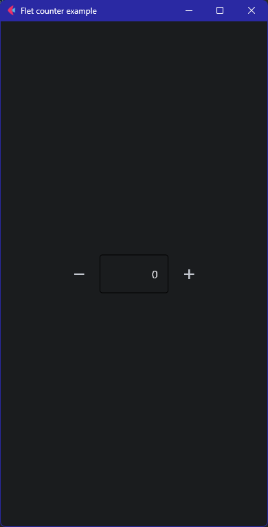

# Техническое описание

## Python
Приложение разработано с использованием языка программирования Python. Python является мощным и универсальным языком программирования с широким спектром библиотек и фреймворков.
## Flet

### Установка модуля Flet {id="flet_1"}
Flet - это библиотека для создания графических пользовательских интерфейсов в стиле Flutter, написанная на Python. Она облегчает создание красивых и анимированных пользовательских интерфейсов.

Flet требует Python 3.7 или выше. Для начала нужно установить модуль`flet`. Для этого в терминале пишем:

```
pip install flet
```
и запускаем наш проект:
```
python app.py
```
Для проверки работоспособности модуля и проекта, запустим простое Counter-приложение, используя пример кода из официальной документации:

```Python
import flet as ft

def main(page: ft.Page):
    page.title = "Flet counter example"
    page.vertical_alignment = ft.MainAxisAlignment.CENTER

    txt_number = ft.TextField(value="0", text_align=ft.TextAlign.RIGHT, width=100)

    def minus_click(e):
        txt_number.value = str(int(txt_number.value) - 1)
        page.update()

    def plus_click(e):
        txt_number.value = str(int(txt_number.value) + 1)
        page.update()

    page.add(
        ft.Row(
            [
                ft.IconButton(ft.icons.REMOVE, on_click=minus_click),
                txt_number,
                ft.IconButton(ft.icons.ADD, on_click=plus_click),
            ],
            alignment=ft.MainAxisAlignment.CENTER,
        )
    )

ft.app(target=main)
```




## SQLite3